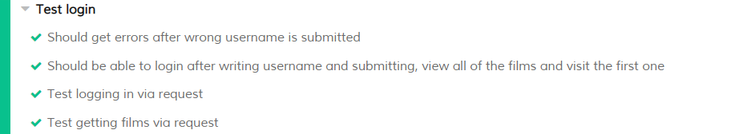

# Project 4 documentation

The movie data in our database is gathered from [The Open Movie Database API](http://www.omdbapi.com/) [(CC BY-NC 4.0)](https://creativecommons.org/licenses/by-nc/4.0/)  
# Setup
The repository includes 2 folders, one for the frontend part of the project and one for the backend part, each with their own package.json. The frontend part is a normal create-react-app project, using the normal commands for running and building the application (i.e. just use _npm start_ or _npm run build_ after running _npm install_).

It is also necessary to run _npm run install_ in the backend-folder, which can then be started using _npm start_.

The _src/actions/constants.js_ includes a line that can be commented in/out to switch between using the backend on localhost or the one on the virtual machine

When running locally, the application must be accessed from localhost:3000/prosjekt4 due to the way the routing works on the virtual machine.

# Site functionality and features
The website created for this project is a database that allows user to mark movies as watched and/or liked, as well as different methods of searching and filtering the dataset.

The first page a user will see is the login page, where for simplicity's sake we only use usernames.

After loging in, the user will be presented with the front page, showing the list of movies in our database ranked in order of their IMDb rating.

Here, watched and liked movies will be visually reflected in the movie posters by either being darkened or having a heart in the lover left corner respectively.

The bars at the top allows the user to search for a movie by title, filter away movies if they are watched or by year of release. It is also possible to sort the movies by their IMDb top 250 rank, release year or runtime.

Clicking on a movie takes the user the movie page for that specific movie, showing more information about it such as director, actors, plot, year of release etc.

This page also allows the user to mark the movie as watched or liked, which will then be stored in the database.

# Technology
For this project we were required to make a database of some type of object that was accessible from a React frontend through an API. This API would also have to support searching/filtering of information, and for a user to change or add to the data stored in the database. With these requirements in mind, we decided to use the following technologies.
## Backend
### Node / Express
The backend service itself is running through [Express](https://expressjs.com/) which is a Javascript web-framework for Node.js.

Due to the fact that Express is made to be "minimal and flexible", use of this framework made setup easy, and we were able to get a functioning API service up and running very fast. The fact that Express uses Javascript, which we have been using throughout this course, also made getting started easy.

The API is setup to be available on port 4000, at the _/graphql_ endpoint. Due to the fact that we are not very concerned about security, and for ease of use, the Express server is set up to allow cross-origin requests from all sources (\*).

### sqlite
Due to the relatively simple requirements of our database, and for ease of use. We decided to use sqlite3 as our database of choice. This allowed for easy portability and deployment on the virtual machine and among team members, while still allowing us to use regular SQL-syntax in our queries (with some exceptions, see [SQL Features That SQLite Does Not Implement](https://www.sqlite.org/omitted.html).

### GraphQl
For the API itself, we were allowed to use either a regular REST api, or GraphQL. Since neither of the group members had used GraphQl previously, but were interested in learning how to implement it, the choice was made to use GraphQl. In retrospect, this turned out to be a good solution, as GraphQl proved to be easy to use and implement, as well as having many nifty features that worked well with how we implemented our application.

In essence GrapQl allows you to ask for just what you need, meaning that we could get responses that only contain the data we are interested in for different sections of application. The main type of our schema is the Movie object, which is able to contain the following information
~~~
type Movie {
    id: String
    title: String
    released: String
    genre: String
    director: String
    plot: String
    writer: String
    runtime: String
    year: String
    awards: String
    poster: String
    imdbRating: String
    production: String
    actors: String
    watched: Int
    liked: Int
    rank: String
}
~~~

A typical query would then look like this
~~~
query{
  films (uid:1, first:3, skip:0) {
    movies {
      title
      released
      runtime
    }
   	total
    offset
  }
}
~~~
Which would return a response containing the following information
~~~
{
  "data": {
    "films": {
      "movies": [
        {
          "title": "The Shawshank Redemption",
          "released": "14 Oct 1994",
          "runtime": "142 min"
        },
        {
          "title": "The Godfather",
          "released": "24 Mar 1972",
          "runtime": "175 min"
        },
        {
          "title": "The Godfather: Part II",
          "released": "20 Dec 1974",
          "runtime": "202 min"
        }
      ],
    "total": 250,
    "offset": 0
    }
  }
}
~~~
As is demonstrated, the fields are pick-and-choose, meaning you could include _director_ or _plot_ as well, or any of the fields defined in the schema. We also have _mutations_ allowing changes to the database, such as updating liked/watched status or adding users.

The benefit of defining mutations, is that you always know when you will be making changes to the database as opposed to just reading, as you specifically need to define the request as a mutation instead of just a query.

This allows us, as seen above, to slice and dice the data recieved from the backend to allow for pagination and therefore allows you to recieve as much information as deemed necessary. We have also implemented searching and filtering in the backend which allows you to further modify the data recieved to suit your needs. 

## Frontend

### React
As mentioned previously, using React was a requirement for this project. React has been explained in detail in previous documentation, and if you're reading this you're probably familiar with it. Nonetheless, it is an extremely useful framework that makes it possible to write powerful single page applications and user interfaces using modular components that updates only when they need to.

Some of the concepts integral to React, such as components, props and state are important to learn and use correctly, but when used well it is possible to create advanced user interfaces that are maintainable and modular.  

### Redux
The use of Redux as the state management framework, made development very convenient as the application grew more complex. Handling API requests and pagination information through the use of Redux actions and reducers greatly increased maintainability and speed of development as we now had a good way of knowing exactly when and how the state was being changed. The use of the store as the so-called "single source of truth" also made sure all the components that needed the different information had one place to get it from, and it provided persistence in the form of pagination and search results when navigating through the application.

### react-router

React router was useful in allowing us to set up all the routes used in the application as well as redirects to the login page if the user is not loged in.
Currently, the routes used are _prosjekt4/_ which is the log-in page. If a user is logged in, they will be redirected to _prosjekt4/films_, which is the main page of the application. When a user clicks on a movie, they will be routed to _prosjekt4/films/:id_, where id is in the form of _tt4154756_.

Currently, there is a minor known issue with the routing on the virtual machine. Where if a user tries to enter a movie page directly, they will be redirected to _prosjekt4/films_, although this does not negatively impact the use of the application, it does work when running the application locally, so we suspect it might be an issue with the configuration of the apache server.   

# Work Methodology
As before, our work methodology was influenced by the fact that we worked in a group of two. Most of the coding was done in either in the form of pair programming or while working together. This was an effective way for us to work, and we had a steady progress throughout the whole project. When not working together, we made use of frequent online communication and updates as well as appropriate use of the collaborative features of our version control system.

In this assignment we used Gitlab instead of GitHub, but Gitlab proved to be a good replacement. Most of the features we had gotten used to from GitHub were there in Gitlab, and we made frequent use of merge requests, issues etc. This allowed us to always have a good overview of what was being worked on and what we still had to implement, while also giving us a good way of keeping track of our progress.

Since we worked on both a backend part and a frontend part, the use of labels proved useful in identifying what issues and commits were relevant to the different parts of the project.

# Testing
In our effort of testing the final product we made use of both unit testing and end-to-end testing of different parts of the finished project.
In the backend part, unit testing was the main focus. The unit tests were implemented using the Jest JavaScript framework.

Here we tested different parts of the schemas and queries we had implemented, as well as mutations. To see that everything was being handled correctly by the GraphQl api. A summary of our backend tests can be seen below.
~~~
PASS  __tests__/getFilms.test.js
 test sorting
   √ Expect year to sort correctly (8ms)
   √ Expect runtime to sort correctly (2ms)
   √ Expect rank to sort correctly (2ms)
 Test schema and queries
   √ Expect list of movies as array (20ms)
   √ Expect movie object to only contain fields in query (4ms)
   √ Expect error on unvalid field (4ms)
   √ Expect error if query does not contain uid (2ms)
   √ Expect error if query does not contain pagination argument (2ms)
   √ Expect error if title argument is not string (3ms)

PASS  __tests__/user.test.js
 A user
   √ Is able to add a new user to the database (1023ms)
   √ Can fetch ("login") username and uid from the database (1005ms)

   Test Suites: 2 passed, 2 total
    Tests:       11 passed, 11 total
    Snapshots:   0 total
    Time:        7.866s
    Ran all test suites.
~~~

With the front-end part, we focused on implementing end-to-end testing with the Cypress JavaScript Framework. This allowed us to see that different parts of our user interface was working correctly, and that a user could navigate through the application in a correct manner.

This also allowed us to test that everything was being rendered in a correct manner and that the correct information was returned based on the users input. As a consequence, the end-to-end testing also worked as a good complement to the unit testing implemented in the backend.
A summary of our end-to-end tests can be seen below:

We did not use unit tests for the frontend itself as our frontend's internal structure is so simple and controlled by redux that the end-to-end testing should find most of the potential bugs which would pop up. We would have added unit tests given a larger application with more complex logic and a larger timeframe.

While we have not implemented testing for every part, we are testing pertinent parts of the program in an effort to show an understanding of a methodological approach to unit end end-to-end testing within the scope of this project and the time constraints.
